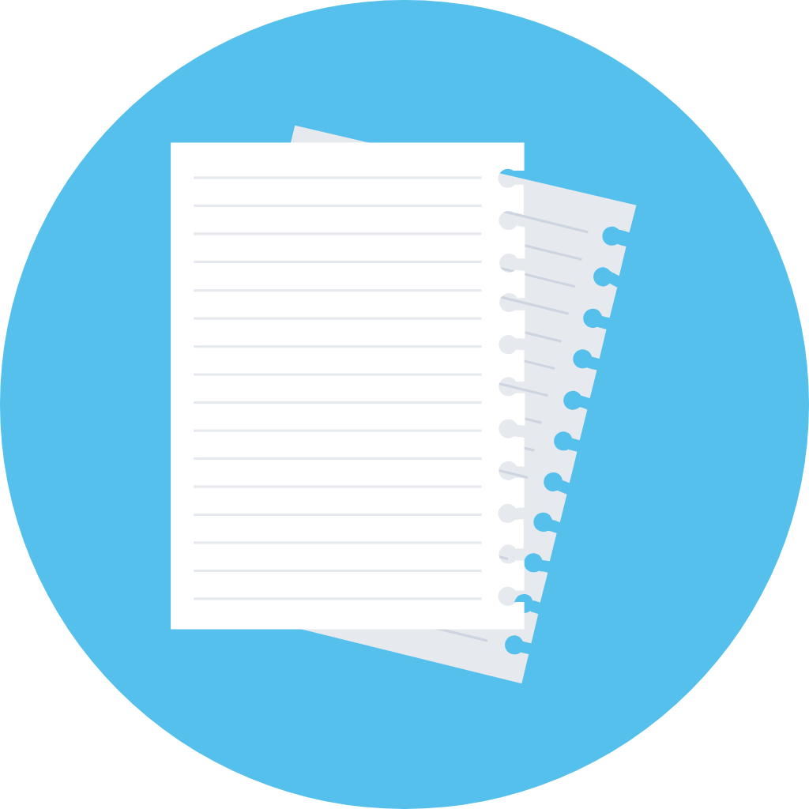

<div id="top"></div>

<!-- PROJECT SHIELDS -->
<!--
*** Reference link notation in markdown. Look at the bottom of the file
*** for all links to the shields.
*** https://www.markdownguide.org/basic-syntax/#reference-style-links
-->
[![MIT License][license-shield]][license-url]
[![LinkedIn][linkedin-shield]][linkedin-url]

<!-- PROJECT LOGO -->
<br />
<div align="center">
  <a href="https://github.com/PattyCoding123/my-notes-project">
    
  </a>
  
<h1 align="center">My Notes Project</h1>

  <p align="center">
    My Notes Project is my introductory project to the Flutter framework. It includes a finished note-taking app that utilizes Flutter for the business/presentation
    logic, and it also uses Firebase for backend authentication and data storage with Cloud Storage. The app allows users to sign-up for an account which they must
    verify with their email address, and once they reach the main page of the app, they can create, read, update, delete, and even share notes.
    <br />
    <a href="https://github.com/github_username/repo_name"><strong>Explore the docs »</strong></a>
    <br />
    <br />
    <a href=#usage>View Demo</a>
    ·
    <a href="https://github.com/PattyCoding123/my-notes-project/issues">Report Bug</a>
    ·
    <a href="https://github.com/PattyCoding123/my-notes-project/issues">Request Feature</a>
  </p>
</div>


<!-- TABLE OF CONTENTS -->
<details>
  <summary>Table of Contents</summary>
  <ol>
    <li>
      <a href="#about-the-project">About The Project</a>
      <ul>
        <li><a href="#built-with">Built With</a></li>
      </ul>
    </li>
    <li>
      <a href="#getting-started">Getting Started</a>
      <ul>
        <li><a href="#prerequisites">Prerequisites</a></li>
        <li><a href="#installation">Installation</a></li>
      </ul>
    </li>
    <li><a href="#usage">Usage</a></li>
    <li><a href="#roadmap">Roadmap</a></li>
    <li><a href="#contributing">Contributing</a></li>
    <li><a href="#license">License</a></li>
    <li><a href="#contact">Contact</a></li>
    <li><a href="#acknowledgments">Acknowledgments</a></li>
  </ol>
</details>


<!-- ABOUT THE PROJECT -->
## About The Project

As mentioned earlier, the project was my first hands-on experience using the Flutter framework as well as working with any sort of backend software in general. I utilized a full Flutter course to help guide me throughout the entire course of the project (https://youtu.be/VPvVD8t02U8). Many different packages from pub.dev helped in the developement of this project. 

<p align="right">(<a href="#top">back to top</a>)</p>


### Built With

* [![Flutter][Flutter-shield]][Flutter-url]
* [![Firebase][Firebase-shield]][Firebase-url]
* [![Android Studio][Android-Studio-shield]][Android-Studio-url]
<p align="right">(<a href="#top">back to top</a>)</p>


<!-- GETTING STARTED -->
## Getting Started

This is an example of how you may give instructions on setting up your project locally.
To get a local copy up and running follow these simple example steps.

### Prerequisites

This is an example of how to list things you need to use the software and how to install them.
* npm
  ```sh
  npm install npm@latest -g
  ```

### Installation

1. Get a free API Key at [https://example.com](https://example.com)
2. Clone the repo
   ```sh
   git clone https://github.com/github_username/repo_name.git
   ```
3. Install NPM packages
   ```sh
   npm install
   ```
4. Enter your API in `config.js`
   ```js
   const API_KEY = 'ENTER YOUR API';
   ```

<p align="right">(<a href="#top">back to top</a>)</p>


<!-- USAGE EXAMPLES -->
## Usage

Use this space to show useful examples of how a project can be used. Additional screenshots, code examples and demos work well in this space. You may also link to more resources.

_For more examples, please refer to the [Documentation](https://example.com)_

<p align="right">(<a href="#top">back to top</a>)</p>


<!-- ROADMAP -->
## Roadmap

- [ ] Feature 1
- [ ] Feature 2
- [ ] Feature 3
    - [ ] Nested Feature

See the [open issues](https://github.com/github_username/repo_name/issues) for a full list of proposed features (and known issues).

<p align="right">(<a href="#top">back to top</a>)</p>


<!-- CONTRIBUTING -->
## Contributing

If you have a suggestion that would make this project better or more optimal, please fork the repo and create a pull request. Alternatively, you can open an issue with the tag "enhancement" as well.

1. Fork the Project
2. Create your Feature Branch (`git checkout -b feature/AmazingFeature`)
3. Commit your Changes (`git commit -m 'Add some AmazingFeature'`)
4. Push to the Branch (`git push origin feature/AmazingFeature`)
5. Open a Pull Request

<p align="right">(<a href="#top">back to top</a>)</p>


<!-- LICENSE -->
## License

Distributed under the MIT License. See `LICENSE.md` for more information.

<p align="right">(<a href="#top">back to top</a>)</p>


<!-- CONTACT -->
## Contact

Patrick Ducusin - patrickducusin2@gmail.com

Project Link: [https://github.com/PattyCoding123/my-notes-project](https://github.com/PattyCoding123/my-notes-project)

<p align="right">(<a href="#top">back to top</a>)</p>


<!-- ACKNOWLEDGMENTS -->
## Acknowledgments
* [Vandad Nahavandipoor for the amazing guide into Flutter](youtube.com/channel/UC8NpGP0AOQ0kX9ZRcohiPeQ)
* [Note Icon by svgrepo.com](https://www.svgrepo.com/)

<p align="right">(<a href="#top">back to top</a>)</p>


<!-- MARKDOWN LINKS & IMAGES -->
<!-- https://www.markdownguide.org/basic-syntax/#reference-style-links -->
[license-shield]: https://img.shields.io/github/license/PattyCoding123/my-notes-project.svg?style=for-the-badge
[license-url]: https://github.com/PattyCoding123/my-notes-project/blob/master/LICENSE.md
[linkedin-shield]: https://img.shields.io/badge/-LinkedIn-black.svg?style=for-the-badge&logo=linkedin&colorB=555
[linkedin-url]: https://www.linkedin.com/in/patrick-ducusin-879b25208/
[product-screenshot]: images/screenshot.png
[Flutter-shield]: https://img.shields.io/badge/Flutter-02569B?style=for-the-badge&logo=flutter&logoColor=white
[Flutter-url]: https://flutter.dev/
[Firebase-shield]: https://img.shields.io/badge/firebase-ffca28?style=for-the-badge&logo=firebase&logoColor=black
[Firebase-url]: https://firebase.google.com/
[Android-Studio-shield]: https://img.shields.io/badge/Android_Studio-3DDC84?style=for-the-badge&logo=android-studio&logoColor=white
[Android-Studio-url]: https://developer.android.com/studio
